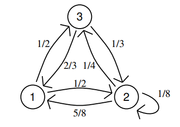

```{r setup, include=FALSE}
library(knitr)
library(R2jags)
library(ggplot2)
library(ggmcmc)
library(LaplacesDemon)
library(stringr)
knitr::opts_chunk$set(echo = TRUE)

# the default output hook
hook_output = knit_hooks$get('output')
knit_hooks$set(output = function(x, options) {
  if (!is.null(n <- options$out.lines)) {
    x = unlist(stringr::str_split(x, '\n'))
    if (length(x) > n) {
      # truncate the output
      x = c(head(x, n), '....\n')
    }
    x = paste(x, collapse = '\n') # paste first n lines together
  }
  hook_output(x, options)
})

set.seed(123) 
```

```{r, include=FALSE, include=FALSE, warning=FALSE}
opts_chunk$set(out.lines = 23)
```


```{r,echo=FALSE}
load("Homework_1.RData")
my_id <- 104
```


## Michelangelo Saveriano

\vspace*{0cm}


\vspace*{1cm}

### Excercise 1

#### 1.a 
##### Illustrate the characteristics of the statistical model for dealing with the *Dugong*'s data 
The data we are considering describe the lengths ($Y_i$) and ages ($x_i$) of  27 dugongs captured off the coast of Queensland.

```{r, echo=FALSE}
plot(mydata$x, mydata$Y, xlab = 'Age', ylab = 'Length', main = 'Dugong')
```


As we can see from the plot above age and length are **not linearly related**, that's why the following regression model is considered:

$$
\begin{align}
Y_i &\sim N(\mu_i, \tau^2) \\
\mu_i=f(x_i) &= \alpha - \beta \gamma^{x_i}\\
\end{align}
$$

Model parameters are
$\alpha \in (1, \infty)$,
$\beta \in (1, \infty)$,
$\gamma \in (0,1)$,
$\tau^2 \in (0,\infty)$. 

Let us consider the following prior distributions:
$$
\begin{align}
\alpha &\sim N(0, \sigma^2_{\alpha}) \\
\beta  &\sim N(0, \sigma^2_{\beta}) \\
\gamma &\sim Unif(0, 1) \\
\tau^2 &\sim IG(a, b) (Inverse Gamma)
\end{align}
$$

#### 1.b
##### Derive the corresponding likelihood function

The Likelihood function, up to a proportionality constant, is:

$$
\begin{align}
L_y(\alpha, \beta, \gamma, \tau^2) &= \prod_{i=1}^n f(y_i | \alpha, \beta, \gamma, \tau^2) \\ 
&\propto \prod_{i=1}^n \frac{1}{\tau^{2}} \ \exp \left( -\frac{(y_i - \mu_i)^2}{2 \tau^2}  \right) \\
&\propto \tau^{-2n} \ \exp \left(-\frac{1}{2 \tau^2} \sum_{i=1}^n (y_i - \alpha + \beta \gamma^{x_i})^2 \right)
\end{align}
$$

#### 1.c 
##### Write down the expression of the joint prior distribution of the parameters at stake and illustrate your suitable choice for the hyperparameters.

We can assume the parameter being independent each other and therefore write the joint prior distribution as the product of the marginal distributions:

$$
\begin{align}
\pi(\alpha, \beta, \gamma, \tau^2) &= \pi(\alpha) \pi(\beta) \pi(\gamma) \pi(\tau^2) \\
&\propto \frac{\tau^{2(-a-1)}}{\sigma_\alpha \sigma_\beta} \exp \left( -\frac{\alpha^2}{2 \sigma_{\alpha}} - \frac{\beta^2}{2 \sigma_{\beta}} - \frac{b}{\tau^2} \right) 1_{[1,\infty]}(\alpha) \ 1_{[1,\infty]}(\beta) \  1_{[0,1]}(\gamma) \ 1_{[0,\infty]}(\tau)
\end{align}
$$
The values we choose for the hyperparameters are the following:

* Since we have no prior information on the parameter $\alpha$ we impose an high value for its variance: $\sigma_\alpha = 1$

* Since we have no prior information on the parameter $\beta$ we impose an high value for its variance: $\sigma_\beta = 1$

* Since $\tau^2$ describes the length variance, assuming $\mu_i = c \ \forall \ i$, we impose $\mathbb{E}[\tau^2] = \mathbb{V}ar[Y_i]$ and $\mathbb{V}ar[\tau^2] = 1$ for the same reason above. Given these constraints we get $a = 2.00569, b=0.07586$


#### 1.d/e

##### Derive the functional form  (up to proportionality constants) of all *full-conditionals*. Which distribution can you recognize within standard parametric families so that direct simulation from full conditional can be easily implemented ?

* $\pi(\alpha | \beta, \gamma, \tau^2, y^{obs}), \ \alpha \in [1, +\infty]$ 

$$
\begin{align}
\pi(\alpha | \beta, \gamma, \tau^2, y^{obs}) &= \pi(\alpha) L_{y^{obs}}(\alpha, \beta, \gamma, \tau^2) \\
&\propto \exp \left( {-\frac{\alpha^2}{2 \sigma_\alpha}} \right) \exp \left( -\frac{1}{2 \tau^2} \sum_{i=1}^n (y_i - \alpha + \beta \gamma^{x_i})^2 \right) \\
&= \exp \left( {-\frac{\alpha^2}{2 \sigma_\alpha}} \right) \exp \left( -\frac{1}{2 \tau^2} \sum_{i=1}^n \Big( y_i^2 - 2y_i(\alpha - \beta \gamma^{x_i}) + (\alpha - \beta \gamma^{x_i})^2 \Big) \right) \\
&\propto \exp \left( {-\frac{\alpha^2}{2 \sigma_\alpha}} \right) \exp \left( -\frac{1}{2 \tau^2} \sum_{i=1}^n \Big( - 2y_i \alpha + \alpha^2 - 2 \alpha \beta \gamma^{x_i} \Big) \right) \\
&= \exp \left( {-\frac{\alpha^2}{2 \sigma_\alpha}} \right) \exp \left( -\frac{1}{\tau^2} \left[ \Big( -\sum_{i=1}^n(y_i + \beta \gamma^{x_i}) \Big) \alpha + \frac{n}{2} \alpha^2 \right] \right) \\
&= \exp \left( \alpha \left( \frac{1}{\tau^2} \sum_{i=1}^n (y_i + \beta \gamma^{x_i}) \right) - \frac{\alpha^2}{2} \left( \frac{n}{\tau^2} + \frac{1}{\sigma_{\alpha}^2} \right) \right) \\
\end{align}
$$

Please notice that if the $\theta$'s pdf can be expressed as $p(\theta) \sim \exp \left( - \frac{1}{2} a \theta^2 - b \theta \right)$ then $\theta \sim N(\mu = \frac{b}{a}, \sigma^2 = \frac{1}{a})$.

Using the relation above we can derive:

$$
\pi(\alpha | \beta, \gamma, \tau^2, y^{obs}) \sim N \left( \mu = \frac{b}{a}, \sigma^2 = \frac{1}{a} \right) \\
where \begin{cases}
a = \frac{n}{\tau^2} + \frac{1}{\sigma_{\alpha}^2} \\
b = \frac{1}{\tau^2} \sum_{i=1}^n (y_i + \beta \gamma^{x_i})
\end{cases}
$$


* $\pi(\beta | \alpha, \gamma, \tau^2, y^{obs}), \ \beta \in [1, +\infty]$ 

$$
\begin{align}
\pi(\beta | \alpha, \gamma, \tau^2, y^{obs}) &= \pi(\beta) L_{y^{obs}}(\alpha, \beta, \gamma, \tau^2) \\
&\propto \exp \left( {-\frac{\beta^2}{2 \sigma_\beta}} \right) \exp \left( -\frac{1}{2 \tau^2} \sum_{i=1}^n (y_i - \alpha + \beta \gamma^{x_i})^2 \right) \\
&= \exp \left( {-\frac{\beta^2}{2 \sigma_\beta}} \right) \exp \left( -\frac{1}{2 \tau^2} \sum_{i=1}^n \Big( y_i^2 - 2y_i(\alpha - \beta \gamma^{x_i}) + (\alpha - \beta \gamma^{x_i})^2 \Big) \right) \\
&\propto \exp \left( {-\frac{\beta^2}{2 \sigma_\beta}} \right) \exp \left( -\frac{1}{2 \tau^2} \sum_{i=1}^n \Big( 2 y_i \beta \gamma^{x_i} - 2 \alpha \beta \gamma^{x_i} + \beta^2 \gamma^{2x_i} \Big) \right) \\
&= \exp \left( {-\frac{\beta^2}{2 \sigma_\beta}} \right) \exp \left( -\frac{1}{\tau^2} \left[ \Big( -\sum_{i=1}^n(y_i \gamma^{x_i} - \alpha \gamma^{x_i}) \Big) \beta + \frac{\gamma^{2x_i}}{2} \beta^2 \right] \right) \\
&= \exp \left( \beta \left( \frac{1}{\tau^2} \sum_{i=1}^n (\alpha \gamma^{x_i} - y_i \gamma^{x_i}) \right) - \frac{\beta^2}{2} \left( \frac{1}{\tau^2} \sum_{i=1}^n \gamma^{2x_i} + \frac{1}{\sigma_{\beta}^2} \right) \right) \\
\end{align}
$$

Using the relation above we can derive:

$$
\pi(\beta | \alpha, \gamma, \tau^2, y^{obs}) \sim N \left( \mu = \frac{b}{a}, \sigma^2 = \frac{1}{a} \right) \\
where \begin{cases}
a = \frac{1}{\tau^2} \sum_{i=1}^n \gamma^{2x_i} + \frac{1}{\sigma_{\beta}^2} \\
b = \frac{1}{\tau^2} \sum_{i=1}^n (\alpha \gamma^{x_i} - y_i \gamma^{x_i})
\end{cases}
$$ 
Please notice that, due to their support constraints, both $\alpha, \beta$ follow a **truncated normal distribution**.

* $\pi(\gamma | \alpha, \beta, \tau^2, y^{obs})$

$$
\begin{align}
\pi(\gamma|\alpha,\beta,\tau^2,y^{obs}) &\propto \exp \bigg( -\frac{1}{2\tau^2} \sum_{i=1}^n (y_i - \mu_i)^2 \bigg) 1_{[0,1]}(\gamma) \\ 
&=\exp \bigg( -\frac{1}{2 \tau^2} \sum_{i=1}^n (y_i - (\alpha - \beta \gamma^{x_i}))^2 \bigg) 1_{[0,1]}(\gamma) \\ 
&\propto \exp\bigg(-\frac{1}{2\tau^2} \sum_{i=1}^n (2 y_i \beta \gamma^{x_i} - 2 \alpha  \beta \gamma^{x_i} + \beta^2 \gamma^{2x_i})\bigg) 1_{[0,1]}(\gamma)
\end{align}
$$

Differently from the other parameters the $\gamma$ full-conditional doesn't follow a standard distribution, so  we have to use an algorithm like Metropolis Hasting to draw values from it.


* $\pi(\tau^2 | \alpha, \beta, \gamma, y^{obs})$

$$
\begin{align}
\pi(\tau^2 | \alpha, \beta, \gamma, y^{obs}) &\propto (\tau^2)^{-a - 1} \exp \bigg( -\frac{b}{\tau^2} \bigg) \tau^{-2 \frac{n}{2}} \exp \left( -\frac{1}{2\tau^2} \left( \sum_{i=1}^n (y_i - \alpha + \beta \gamma^{x_i})^2 \right) \right) \\
&= (\tau^2)^{-a - \frac{n}{2} - 1} \exp \left(-\frac{1}{2\tau^2} \left( 2 b + \sum_{i=1}^n (y_i - \alpha + \beta \gamma^{x_i})^2 \right) \right)
\end{align}
$$

From this we can clearly see that the $\tau^2$ full-conditional has an **Inverse Gamma** shape:

$$
\pi(\tau^2 | \alpha, \beta, \gamma, y^{obs}) \sim IG\left(a + \frac{n}{2}, b + \frac{1}{2} \sum_{i=1}^n (y_i - \alpha + \beta \gamma^{x_i})^2 \right)
$$

#### 1.f
##### Using a suitable Metropolis-within-Gibbs algorithm simulate a Markov chain ($T=10000$) to approximate the posterior distribution for the above model

**Gibbs Sampling**

The Gibbs sampling is an algorithm which allows us to simulate a sequence of dependent random variables starting from all the full conditionals. The algorithm:

1. fix the starting values of the parameter components at time $t=0$:

$$
\boldsymbol{\theta}^0 = (\theta_1, \theta, \dots, \theta_k)
$$

2. for $t=1,\dots, T$ iterate the following cycle:

$$
\theta_j^{t+1} \sim \pi(\theta_j, \theta_{(j)}) = \pi(\theta_j | \theta_1^{t+1}, \dots, \theta_{j-1}^{t+1}, \theta_{j+1}^{t}, \dots, \theta_{k}^{t}) \ \ \ j=1, \dots, k
$$

**Metropolis-Hastings**

Metropolis-Hastings is an algorithm which allows us to simulate a sequence of dependent random variables drawn from a proposal distribution $p_x(y)$, where $x$ is the current state of the chain. Unlike the Gibbs sampler which relies on conditional distribution, the Metropolis-Hastings algorithm uses the joint distribution to generate a candidate draws. The algorithm works as follow:

1. Draw a candidate $Y_{t+1} = y \sim p_x(y)$
2 Decide whether or not the candidate is accepted as the next
state of the chain at time $t+1$

$$
X_{t+1} = 
\begin{cases}
y & \text{with probability } \ \alpha(x, y) \\
x & \text{with probability } \ 1 -\alpha(x, y) \\
\end{cases}
$$
where

$$
\alpha(x, y) = \min \left\{ \frac{\pi(y) p_y(x)}{\pi(x) p_x(y)}, 1\right\}
$$

**Metropolis-within-Gibbs**

Gibbs sampling requires the knowledge of the full conditionals to work, unfortunately, since $\gamma$ does not follow a well-known parametric distribution, we're lacking this information. To overcome this issue we can use the Metropolis-within-Gibbs algorithm which allows us to replace the original i-th kernel $K_i$ with one related to the Metropolis algorithm $\tilde{K}_i^{MET_i}$.

To perform such simulations we'll use the Jags library.

```{r}

parameters <- c("alpha", "beta", "gamma", "tau2", 
                "Ypred_20", "cond_exp_20", "Ypred_30", "cond_exp_30")

dugongjags <- jags(data=mydata,
                   # let JAGS choose the initial values
                   parameters.to.save=parameters,
                   model.file="dugong_jags_model.txt",
                   DIC = F,
                   n.chains=1,
                   n.burnin=1,
                   n.iter=10000)
print(dugongjags)


```
#### 1.g
##### Show the 4 univariate trace-plots of the simulations of each parameter

As we can see from the trace-plots below all the parameters converge to some stationary distribution.

```{r, echo=FALSE, out.width = "100%"}
dugongjags_mcmc <- as.mcmc(dugongjags)
dugongjags_ggs <- ggs(dugongjags_mcmc)
dugongjags_ggs_filt <- dugongjags_ggs %>% filter(Parameter %in% c('alpha', 'beta', 'gamma', 'tau2'))

ggs_traceplot(dugongjags_ggs_filt, greek = T)+
  aes(color = Parameter)
```


#### 1.h
##### Evaluate graphically the behaviour of the empirical averages $\hat{I}_t$  with growing $t=1,...,T$

The parameter convergence can also be observed through the empirical cumulative average.

```{r echo=FALSE, out.width = "100%"}
ggs_running(dugongjags_ggs_filt, greek = T)+
  aes(color = Parameter) 
```

#### 1.i
##### Provide estimates for each parameter together with the approximation error and explain how you have evaluated such error

The estimates for each parameter can be easily computed using the empirical mean. 

To evaluate the approximation error we have to take into account the temporal dependency between the samples: contrary to standard MC, where the samples are iid, in a MCMC setting the current state depends on the previous one. Therefore we have to compute the MCMC variance as the MC variance divided by a penalisation term that depends on the correlation between the samples:

$$
\mathbb{V}ar_{MCMC}[\hat{I}] = \frac{\mathbb{V}ar[\hat{I}]}{S_{eff}}
$$

where $S_{eff}$ measures the effective sample size. This quantity can be interpreted as the number of independent Monte Carlo samples necessary to carry the same amount of information.

```{r echo= FALSE}
params <- c('alpha','beta','gamma','tau2')

# Extract MC
alpha <- dugongjags$BUGSoutput$sims.array[, 1, 'alpha']
beta <- dugongjags$BUGSoutput$sims.array[, 1, 'beta']
gamma <- dugongjags$BUGSoutput$sims.array[, 1, 'gamma']
tau2 <- dugongjags$BUGSoutput$sims.array[, 1, 'tau2']

# Estimates
mean_alpha <- mean(alpha[100:length(alpha)])
mean_beta <- mean(beta[100:length(beta)])
mean_gamma <- mean(gamma[100:length(gamma)])
mean_tau2 <- mean(tau2[100:length(tau2)])

# Variance
var_alpha <- var(alpha)
var_beta <- var(beta)
var_gamma <- var(gamma)
var_tau2 <- var(tau2)

# ESS
ess_alpha <- ESS(alpha)
ess_beta <- ESS(beta)
ess_gamma <- ESS(gamma)
ess_tau2 <- ESS(tau2)


# Approximation Error
app_err_alpha <- sqrt(var_alpha / ess_alpha)
app_err_beta <- sqrt(var_beta / ess_beta)
app_err_gamma <- sqrt(var_gamma / ess_gamma)
app_err_tau2 <- sqrt(var_tau2 / ess_tau2)

# Result dataframe
result_df = data.frame(Parameters = params, 
                       Estimates = c(mean_alpha, mean_beta, mean_gamma, mean_tau2),
                       Approximation_Error = c(app_err_alpha, app_err_beta, app_err_gamma, app_err_tau2),
                       Variance = c(var_alpha, var_beta, var_gamma, var_tau2),
                       ESS = c(ess_alpha, ess_beta, ess_gamma, ess_tau2)
                       )
kable(result_df, align = "ccc")
```


#### 1.l 
##### Which parameter has the largest posterior uncertainty? How did you measure it?

To measure the posterior uncertainty we can use the equal-tails $95\%$ confidence interval.

```{r echo=FALSE}
CI <- data.frame(row.names = params, 
                 lower_limit = dugongjags$BUGSoutput$summary[params, '2.5%'],
                 upper_limit = dugongjags$BUGSoutput$summary[params,'97.5%'], 
                 length = dugongjags$BUGSoutput$summary[params, '97.5%'] - dugongjags$BUGSoutput$summary[params, '2.5%'])
                
kable(CI, align = "ccc")
```

As we can see the parameter with the highest uncertainty (the parameter whose $95\%$ confidence interval length is the largest) is $\alpha$.

#### 1.m 
##### Which couple of parameters has the largest correlation (in absolute value)?

From the correlation matrix below we can see that the most correlated couple is $(\alpha, \gamma)$.

```{r, echo=FALSE}
kable(cor(data.frame(alpha=alpha,beta=beta,
                     gamma=gamma,tau=tau2)), 
      align = "ccc")
```


#### 1.n/o/p
##### Use the Markov chain to approximate the posterior predictive distribution of the length of a dugong with age of 20 years. Provide the prediction of a different dugong with age 30. Which prediction is less precise?

In order to perform such predictions we ask Jags to provide us samples drawn from the following distributions:

* `Ypred_20`, the predicted dugong length, normally distributed, centered in `cond_exp_20`

* `cond_exp_20`, the conditional expectation regressed for $x=20$

* `Ypred_30`, the predicted dugong length, normally distributed, centered in `cond_exp_30`

* `cond_exp_30`, the conditional expectation regressed for $x=30$

```{r, echo=FALSE}
pred_names <- c('Ypred_20', 'cond_exp_20', 'Ypred_30', 'cond_exp_30')

kable(dugongjags$BUGSoutput$summary[pred_names,], 
      align = "ccc")
```

As expected `Ypred_20` and `cond_exp_20` are centered in almost the same value. The same consideration holds for `Ypred_30` and `cond_exp_30` as well.

```{r, echo=FALSE, out.width="100%"}
dugongjags_ggs_pred <- dugongjags_ggs %>% filter(Parameter %in% pred_names)
dugongjags_ggs_pred[, 'x'] <- as.numeric(str_sub(as.character(dugongjags_ggs_pred$Parameter), -2, -1))

ggplot(dugongjags_ggs_pred, aes(x=value, fill=Parameter)) +
  geom_density(alpha = 0.3) + 
  facet_grid(~ x)
```

In order to compare the precision of the two predictions we can compare the length of $95\%$ confidence interval as we did before.

```{r, echo=FALSE}
kable(data.frame(length = dugongjags$BUGSoutput$summary[c('Ypred_20', 'Ypred_30'), '97.5%'] - dugongjags$BUGSoutput$summary[c('Ypred_20', 'Ypred_30'), '2.5%']))
```

From the table above we see that the prediction `Ypred_20` is slightly less precise than the one for `Ypred_30`. 

Below we can see how the two predictions are distributed.

```{r, echo=FALSE, out.width="100%"}
dugongjags_ggs_pred %>% 
  filter(Parameter %in% c('Ypred_20', 'Ypred_30')) %>%
  ggplot( aes(x=value, fill=Parameter)) +
    geom_density(alpha = 0.3)
```

\newpage

### Excercise 2

Let us consider a Markov chain $(X_t)_{t \geq 0}$ defined on the state space ${\cal S}=\{1,2,3\}$ with the following transition 



and the corresponding transition probability matrix:
$$
P = 
\left(
\begin{matrix}
0 & \frac{1}{2} &\frac{1}{2} \\
\frac{5}{8} & \frac{1}{8} & \frac{1}{4} \\
\frac{2}{3} & \frac{2}{3} & 0 \\
\end{matrix}
\right)
$$

#### 2.a
##### Starting at time $t=0$ in the state  $X_0=1$ simulate the Markov chain with distribution assigned as above for $t=1000$ consecutive times

```{r}
# State space
S = 1:3

# Transition probability matrix
P <- matrix(c(0, 0.5, 0.5, 
              5/8, 1/8, 1/4,
              2/3, 1/3, 0), 
            nrow = 3, 
            byrow = T)

P
```
```{r}
set.seed(1234)

sim_Markov_chain <- function(space, P, x0, N_steps){
  # Vector to store the simulated values
  sim_chain <- rep(NA, N_steps+1) 
  sim_chain[1] <- x0

  # Simulation
  for(t in 1:N_steps){
    sim_chain[t+1] <- sample(space, size=1, prob=P[sim_chain[t], ])
  }
  
  return(sim_chain)
}

# Number of steps
N_steps <- 1000

# Initial state
x_0 <- 1

# Simulated chain
sim_chain <- sim_Markov_chain(S, P, x_0, N_steps)

plot(sim_chain, type = 'b')
```

#### 2.b
##### compute the empirical relative frequency of the two states in your simulation

```{r, echo=FALSE}
rel_freq <- data.frame(table(sim_chain)  / (N_steps + 1))
kable(rel_freq)
rel_freq %>%
  ggplot(aes(x=sim_chain, y=Freq, fill=sim_chain)) + 
  geom_bar(stat="identity")
```

#### 2.c
##### repeat the simulation for 500 times and record only the final state at time $t=1000$ for each of the 500 simulated chains. Compute the relative frequency of the 500 final states. What distribution are you approximating in this way? Try to formalize the difference between this point and the previous point. 

```{r}
M <- 500
t <- 1000

# Simulate M chains
final_states <- sapply(1:M, function(x) sim_Markov_chain(S, P, x_0, N_steps)[t + 1])
```

```{r, echo=FALSE}
rel_freq_mult <- data.frame(table(final_states)  / M)
kable(rel_freq_mult)
rel_freq_mult %>%
  ggplot(aes(x=final_states, y=Freq, fill=final_states)) + 
  geom_bar(stat="identity")
```

In the previous step we were approximating the stationary distribution, ie the distribution we get when $t \rightarrow + \infty$, while in this step we're approximating the distribution for a fixed $t=1000$.

#### 2.d/e
##### compute the theoretical stationary distribution $\pi$ and explain how you have obtained it. Is it well approximated by the simulated empirical relative frequencies computed in (b) and (c)?

Remembering that the stationary distribution $\pi(\cdot)$ satisfy the following conditions:

* $\pi_j\geq0 \ \forall \ j\in S$ 
* $\sum_{j\in S}\pi_j=1$
* $\pi P=\pi$

we can compute it as the normalized eigenvector relative to the eigenvalue $1$.

```{r}
stationary_vect <- eigen(t(P))$vectors[, 1]
stationary_distr <- stationary_vect / sum(stationary_vect)
```
```{r, echo=FALSE}
stationary_distr_df <- data.frame(node = as.character(S), stationary_distr = stationary_distr)
kable(stationary_distr_df)
stationary_distr_df %>%
  ggplot(aes(x=node, y=stationary_distr, fill=node)) + 
  geom_bar(stat="identity")
```

As we can see the stationary distribution $\pi(\cdot)$ is well approximated by the simulated empirical relative frequencies computed in (b) and (c).
  
#### 2.f 
##### what happens if we start at $t=0$ from state $X_0=2$ instead of  $X_0=1$?

```{r}
# Initial state
x_0 <- 2

# Simulated chain
sim_chain_2 <- sim_Markov_chain(S, P, x_0, N_steps)
```

```{r, echo=FALSE}
rel_freq <- data.frame(table(sim_chain_2)  / (N_steps + 1))
kable(rel_freq)
rel_freq %>%
  ggplot(aes(x=sim_chain_2, y=Freq, fill=sim_chain_2)) + 
  geom_bar(stat="identity")
```

As we can see the results we get starting from $X_0=2$ are not much different from the ones we got before in the case of $X_0=1$. The reason for this is because as $t \rightarrow +\infty$ the empirical relative frequencies distribution converges to the stationary distribution.

\vspace{6cm}


